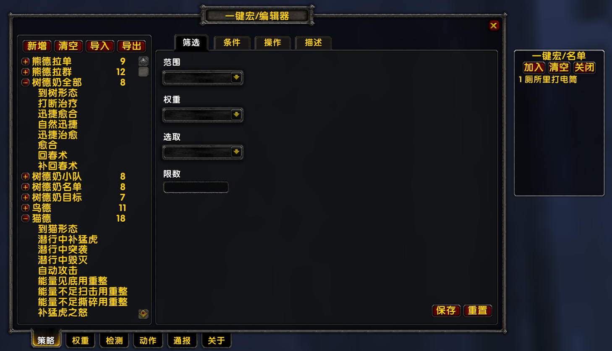

> **！！！注意：可视化编辑器相关功能还在开发中，目前仅支持导入和清空操作。**

# 一键宏
> 可视化通用一键宏插件，如有错误或建议请[点我](https://gitee.com/ku-ba/OneMacro/issues)反馈！

## 功能描述


- 基于ACE2框架开发
- 支持所有职业和天赋
- 支持可视化编辑
- 支持自定义策略
- 支持法术通报
- 支持协助名单
- 支持扩展权重、检测、动作


## 关联依赖
- 模组
    - [SuperWoW](https://github.com/balakethelock/SuperWoW) 导入、导出、GUID检测等
    - [UnitXP_SP3](https://codeberg.org/konaka/UnitXP_SP3) 距离、视角等检测
- 插件
    - [Cursive](https://github.com/pepopo978/Cursive) DOT检验
    - [BetterCharacterStats](https://www.kookapp.cn/direct/anchor/5574114869722737/1993451221059869/88349137786896896) 属性统计
    - [BonusScanner](#) 属性统计
    - [Attackbar](https://www.kookapp.cn/direct/anchor/5574114869722737/1993451221059869/89166230686008064) 攻击计时条


## 安装使用
- 安装插件
    - 安装依赖模组、插件等
    - [下载](https://github.com/xhwsd/OneMacro/archive/master.zip)本插件
    - 复制本插件到客户端的`...\Interface\AddOns`目录
- 导入策略
    - 复制[附加](https://gitee.com/ku-ba/OneMacro/tree/main/附加)中策略到客户端的`...\imports`目录（没有则创建）
    - 小地图图标打开编辑器导入策略（依赖[SuperWoW](https://github.com/xhwsd/SuperMacro/archive/master.zip)）
- 创建宏
    - 创建宏其代码为`/OM strategy execute <欲执行策略名>`
    - 将宏拖至动作条使用

> 注意删除文件夹名末尾的`-main`、`-master`


## 常用命令
```
/script -- 执行指定策略
/OM strategy execute <name>

/script -- 从文件导入策略
/OM strategy import <file>

/script -- 将策略导出到文件
/OM strategy export <file>

/script -- 清空所有策略
/OM strategy clear

/script -- 从文件导入通报
/OM report import <file>

/script -- 将通报导出到文件
/OM report export <file>

/script -- 清空所有通报
/OM report clear

/script -- 恢复小图标取消启用
/OM standby
```

> 聊天框输入`/OM`回车将打印更多命令


## 常用函数
```lua
-- 注册权重；覆盖更新
---@param weights table<string,OM_Weight> 权重表
---@param space string 空间
---@param name? string 名称；初始缺省为空间键名
---@param remark? string 备注；初始缺省为空字符串
---@param order? number 顺序；初始缺省为空间计数递增
---@return boolean success 成功
function OneMacro:RegisterWeights(weights, space, name, remark, order) end

-- 注册检测；覆盖更新
---@param detects table<string,OM_Detect> 检测表
---@param space string 空间
---@param name? string 名称；初始缺省为空间键名
---@param remark? string 备注；初始缺省为空字符串
---@param order? number 顺序；初始缺省为空间计数递增
---@return boolean success 成功
function OneMacro:RegisterDetects(detects, space, name, remark, order) end

-- 注册动作；覆盖更新
---@param actions table<string,OM_Action> 动作表
---@param space string 空间
---@param name? string 名称；初始缺省为空间键名
---@param remark? string 备注；初始缺省为空字符串
---@param order? number 顺序；初始缺省为空间计数递增
---@return boolean success 成功
function OneMacro:RegisterActions(actions, space, name, remark, order) end

-- 执行策略
---@param name string|number 名称或索引
---@param config? table 配置
---@return boolean success 成功
function OneMacro:ExecuteStrategy(name, config) end
```

> 如需自定义扩展权重、检测、动作等，请参考`OneMacro\Extends\*.lua`
